# Documentação do Projeto Wowdash (Versão Next.js)

Esta é a documentação para rodar e utilizar o template administrativo **Wowdash** configurado com **Next.js**.
Esta versão é ideal para sua integração com **WooCommerce** e **Bling**, pois permite criar rotas de API seguras e oferece melhor performance.

## 📋 Pré-requisitos

Antes de começar, certifique-se de ter o **Node.js** instalado em sua máquina.
Você pode verificar se ele está instalado abrindo seu terminal e digitando:

```bash
node -v
npm -v
```

Se não estiver instalado, baixe-o em [nodejs.org](https://nodejs.org/).

## 🚀 Como Instalar

1. Abra o terminal na pasta raiz do projeto.
2. Execute o comando abaixo para instalar todas as dependências necessárias:

```bash
npm install
```

## ▶️ Como Rodar a Aplicação

Para iniciar o servidor de desenvolvimento local:

```bash
npm run dev
```

Este comando irá:
1. Iniciar o servidor Next.js.
2. Disponibilizar a aplicação em `http://localhost:3000`.
3. Habilitar o "Fast Refresh" (atualização instantânea ao editar arquivos).

## 📂 Estrutura do Projeto (App Router)

Esta versão utiliza o **App Router** do Next.js, que é a estrutura mais moderna.

*   **`src/app/`**: Aqui ficam as **páginas** e **rotas** da sua aplicação.
    *   `page.jsx`: É a página inicial (`/`).
    *   Pastas como `dashboard/page.jsx` criam rotas automáticas (ex: `/dashboard`).
    *   `layout.jsx`: Define o layout principal (cabeçalho, menu lateral) que envolve todas as páginas.
*   **`src/components/`**: Contém os componentes reutilizáveis (botões, tabelas, gráficos, etc.).
*   **`public/`**: Arquivos estáticos como imagens, fontes e ícones.
*   **`next.config.js`**: Arquivo de configuração do Next.js.

## 💡 Dicas de Desenvolvimento

*   **Imagens e Assets**: Ao usar imagens na pasta `public`, sempre use caminhos absolutos começando com `/`.
    *   ❌ Errado: `src="assets/images/logo.png"`
    *   ✅ Certo: `src="/assets/images/logo.png"`
*   **Bibliotecas de Terceiros**: Se alguma biblioteca (como mapas ou gráficos) der erro de `window is not defined`, use `useEffect` ou `dynamic import` para garantir que ela só carregue no navegador (cliente).

## 🔗 Integrações (WooCommerce & Bling)

Como você escolheu Next.js, você tem uma grande vantagem: **API Routes**.

Para conectar com o Bling ou WooCommerce sem expor suas senhas:
1. Crie arquivos dentro de `src/app/api/`.
2. Exemplo: `src/app/api/bling/route.js`.
3. Dentro desse arquivo, você fará as chamadas para o Bling usando suas chaves secretas.
4. O seu front-end chamará essa sua API interna (`/api/bling`) em vez de chamar o Bling diretamente.

## ☁️ Como Publicar (Deploy)

A forma mais fácil e recomendada é usar a **Vercel** (criadora do Next.js).

1. Crie uma conta na [Vercel](https://vercel.com/).
2. Instale a Vercel CLI: `npm i -g vercel`
3. Rode o comando `vercel` no terminal e siga os passos.

Ou conecte seu repositório GitHub à Vercel para deploys automáticos a cada alteração.

## 📊 Modelagem de Dados (Proposta - CRM & E-commerce)

Abaixo está o diagrama de entidade-relacionamento (ERD) proposto, baseado na análise dos componentes de interface das páginas de CRM e E-commerce.

```mermaid
erDiagram
    %% Entidades Principais
    Users ||--o{ Orders : "realiza"
    Users ||--o{ Transactions : "gera"
    Users ||--o{ Tasks : "atribuido_a"
    Users ||--o{ UserAssets : "possui_portfolio"
    Users ||--o{ InvestmentTransactions : "executa_investimento"
    Users {
        uuid id PK
        string name "Nome completo"
        string email
        string phone
        string image_url
        string status "active, inactive"
        string role "admin, customer, agent"
        string country "Para mapa e stats (Filtro por Pais)"
        string gender "male, female, other"
        string agent_id "ID legivel se for agente"
        timestamp created_at "Suporta filtro: Novos Usuarios (Hoje/Semana/Mes/Ano)"
        timestamp last_active_at "Suporta filtro: Usuarios Ativos (Hoje/Semana...)"
    }

    Products ||--o{ OrderItems : "contem"
    Products {
        uuid id PK
        string name
        decimal price
        string category "fashion, electronics, etc"
        int stock_quantity
        string stock_status "in_stock, low_stock, out_of_stock"
        string image_url
        string discount_percentage
        int sold_count "Total vendido"
    }

    Orders ||--o{ OrderItems : "possui"
    Orders ||--o{ Transactions : "paga_por"
    Orders {
        uuid id PK
        string invoice_number
        uuid user_id FK
        timestamp date "Suporta filtro: Pedidos (Hoje/Semana/Mes/Ano)"
        string status "pending, paid, shipped, canceled"
        decimal total_amount
    }

    OrderItems {
        uuid id PK
        uuid order_id FK
        uuid product_id FK
        int quantity
        decimal unit_price
        decimal total_price
    }

    Transactions {
        uuid id PK
        uuid order_id FK
        uuid user_id FK
        decimal amount
        string status "pending, completed, rejected"
        timestamp date "Suporta filtro: Receita/Transacoes (Hoje/Semana/Mes/Ano)"
        string payment_method "stripe, paypal, razorpay"
    }

    %% Dados CRM Especificos
    Tasks {
        uuid id PK
        string title
        uuid assigned_to_user_id FK
        date due_date
        string status "active, completed, pending"
        string priority
    }

    %% Dados Financeiros / Analíticos
    Expenses {
        uuid id PK
        string title
        decimal amount
        string category
        timestamp date "Suporta filtro: Despesas (Hoje/Semana/Mes/Ano)"
    }

    Campaigns ||--o{ CampaignAnalytics : "possui_metricas"
    Campaigns {
        uuid id PK
        string name
        string channel "email, website, facebook"
        timestamp start_date
        timestamp end_date
    }

    CampaignAnalytics {
        %% Tabela para suportar graficos de campanha com filtro de tempo
        uuid id PK
        uuid campaign_id FK
        date date "Data da metrica"
        int reach_count
        int conversion_count
        int clicks_count
        decimal cost_spent
    }

    %% Dados de Investimentos (NOVO)
    Assets {
        uuid id PK
        string name "Gold, Dollars, Bitcoin"
        string symbol "XAU, USD, BTC"
        string category "commodity, currency, stock"
        decimal current_price
        string image_url
    }

    UserAssets {
        uuid id PK
        uuid user_id FK
        uuid asset_id FK
        decimal quantity_owned
        decimal average_buy_price
        decimal total_value_current
    }
    UserAssets }o--|| Assets : "referencia"

    InvestmentTransactions {
        uuid id PK
        uuid user_id FK
        uuid asset_id FK
        string type "buy, sell"
        decimal quantity
        decimal price_at_transaction
        decimal total_amount
        string status "completed, in_progress"
        timestamp date "Suporta filtro: Investimentos (Hoje/Semana/Mes/Ano)"
    }
    InvestmentTransactions }o--|| Assets : "envolve"

    Notices {
        uuid id PK
        string title
        string content
        string author_name "Pode ser FK para Users tb"
        string author_image_url
        timestamp date
    }

    InvestmentProjects {
        uuid id PK
        uuid asset_id FK
        string name "Nome do projeto ou ativo"
        int duration_months
        decimal stock_level_percentage "Para progress bar"
        string status
    }
    InvestmentProjects }o--|| Assets : "baseado_em"

    ClientPaymentStatus {
        %% Tabela agregadora para relatorios (pode ser view)
        uuid id PK
        uuid user_id FK
        int paid_count
        int pending_count
        int overdue_count
        date report_week
    }
```


