# Alob Express Manager

Este projeto é um dashboard administrativo moderno (SaaS) baseado no template **WowDash** (Next.js). Atualmente, o projeto consiste na implementação do frontend, com uma arquitetura de backend projetada para suportar operações SaaS robustas e integração de micro-frontends.

## 🏗️ Arquitetura do Sistema

O projeto utiliza uma arquitetura híbrida para integrar aplicações React modernas (Vite) dentro do ecossistema Next.js:

1.  **Next.js (Host - Porta 3001/3002)**: Responsável pela autenticação, rotas principais, dashboard e lógica de negócio.
2.  **Vite (Micro-frontend - Porta 5173/5177)**: Executa a aplicação "Calculadora de Dropshipping", otimizada para interatividade e performance (React 19).
3.  **Proxy Server (Porta 3006)**: Orquestra o tráfego entre o Next.js e o Vite, garantindo que cookies de autenticação e rotas sejam compartilhados corretamente.
    *   Rotas `/__calc/*` -> Redirecionadas para o Vite.
    *   Demais rotas -> Redirecionadas para o Next.js.

## 🚀 Como Executar

### Pré-requisitos

*   Node.js 18+
*   pnpm (recomendado) ou npm

### Instalação

1.  Instale as dependências na raiz:
    ```bash
    npm install
    # ou
    pnpm install
    ```

2.  Instale as dependências da calculadora (micro-frontend):
    ```bash
    cd dropshipping-calculator-app
    pnpm install
    cd ..
    ```

### Configuração de Ambiente (.env.local)

Crie um arquivo `.env.local` na raiz do projeto com as credenciais do Supabase:

```env
NEXT_PUBLIC_SUPABASE_URL=sua_url_do_supabase
NEXT_PUBLIC_SUPABASE_ANON_KEY=sua_chave_anonima_do_supabase
```

### Rodando o Projeto

Utilize o comando unificado que inicia o Next.js, o Vite e o Proxy simultaneamente:

```bash
npm run dev
```

Acesse a aplicação em: **http://localhost:3006** (Porta do Proxy).

> **Nota:** O comando lida automaticamente com conflitos de porta. Se a 3001 estiver ocupada, ele tentará a 3002, e assim por diante.

## 🧮 Calculadora de Dropshipping

A calculadora está acessível na rota **/calculadora**.

*   **Integração**: Feita via `iframe` isolado para evitar conflitos de CSS/JS.
*   **Comunicação**: O Next.js passa a sessão do usuário e tokens via `postMessage` para a calculadora.
*   **Base Path**: A aplicação Vite roda sob o caminho `/__calc/` para servir assets corretamente através do proxy.

## 🧪 Testes Automatizados (Playwright)

O projeto possui uma suíte robusta de testes E2E (End-to-End) cobrindo fluxos de login, acesso à calculadora e integridade de dados.

Para rodar os testes:

```bash
npx playwright test
```

Para ver o relatório (trace viewer):

```bash
npx playwright show-report
```

### Estrutura dos Testes
*   `tests/e2e/login.spec.ts`: Valida fluxos de login e redirecionamento.
*   `tests/e2e/calculator.spec.ts`: Valida o carregamento da calculadora e persistência de dados.

## 🛠️ Solução de Problemas Comuns

### Erro 431 (Request Header Fields Too Large)
Causado por cookies excessivos do Supabase/Next.js.
*   **Solução Implementada**: Um middleware remove cookies antigos ou desnecessários automaticamente. Se persistir, limpe os cookies do navegador.

### Erro de Conexão (ERR_CONNECTION_RESET) no Supabase
Pode ocorrer devido a falhas de rede intermitentes na validação do token.
*   **Solução Implementada**: O serviço `organization-membership.js` possui lógica de *retry* automática para recuperar a conexão.

### Tela Branca ou 404 no Login
*   Verifique se está acessando via porta **3006** (Proxy).
*   Certifique-se de que o arquivo `.env.local` contém as chaves corretas do Supabase.

---

## 🎨 Visão Geral do Frontend (WowDash)

O frontend é construído utilizando **Next.js** e oferece uma interface rica e responsiva.
- **Tecnologia**: Next.js (React)
- **Estilo**: Moderno, responsivo, focado em UX.
- **Módulos de UI**:
    - Dashboards (eCommerce, CRM, Analytics)
    - Gerenciamento de Projetos (Kanban)
    - Configurações de Usuário e Organização
    - Chat e Mensagens

## 🏗️ Arquitetura do Backend (Proposta)

Para suportar as funcionalidades do frontend e transformar o template em um produto SaaS funcional, foi projetada uma arquitetura de banco de dados relacional robusta.

### Principais Conceitos

1.  **Multi-tenancy**: Isolamento de dados por organização (`organization_id`).
2.  **RBAC (Role-Based Access Control)**: Sistema flexível de permissões e papéis.
3.  **Auditoria e Segurança**: Rastreamento de criação (`created_at`), atualização (`updated_at`) e exclusão lógica (`deleted_at`).
4.  **Billing Integrado**: Suporte para planos, assinaturas e faturas.

### Diagrama de Entidade e Relacionamento (DER)

Abaixo está o modelo de dados projetado para atender aos requisitos do sistema:

```mermaid
erDiagram
    ORGANIZATION {
        uuid id PK
        string name
        string slug
        string logo_url
        string website
        string status
        datetime created_at
        datetime updated_at
        datetime deleted_at
    }

    USER {
        uuid id PK
        string email
        string password_hash
        string full_name
        string avatar_url
        string phone
        boolean is_email_verified
        string status
        datetime last_login_at
        datetime created_at
        datetime updated_at
    }

    APP_ADMIN {
        uuid user_id PK
        datetime created_at
    }

    ACCESS_REQUEST {
        uuid id PK
        string email
        string status
        datetime created_at
        datetime reviewed_at
        uuid reviewed_by FK
        text notes
    }

    ORGANIZATION_MEMBER {
        uuid id PK
        uuid organization_id FK
        uuid user_id FK
        uuid role_id FK
        datetime joined_at
    }

    ROLE {
        uuid id PK
        uuid organization_id FK
        string name
    }

    PERMISSION { 
        uuid id PK 
        string scope 
        string description 
    } 

    ROLE_PERMISSION { 
        uuid role_id PK, FK 
        uuid permission_id PK, FK 
    } 

    PLAN { 
        uuid id PK 
        string name 
        decimal price 
        string currency 
        string interval 
        jsonb features 
        boolean is_active 
    } 

    SUBSCRIPTION { 
        uuid id PK 
        uuid organization_id FK 
        uuid plan_id FK 
        string status 
        datetime current_period_start 
        datetime current_period_end 
        string payment_provider_id 
    } 

    INVOICE { 
        uuid id PK 
        uuid subscription_id FK 
        uuid organization_id FK 
        decimal amount 
        string status 
        string pdf_url 
        datetime due_date 
        datetime paid_at 
    } 

    PRODUCT { 
        uuid id PK 
        uuid organization_id FK 
        string name 
        text description 
        decimal price 
        int stock_quantity 
        string sku 
        boolean is_digital 
        datetime created_at 
        datetime updated_at 
    } 

    ORDER { 
        uuid id PK 
        uuid organization_id FK 
        uuid customer_id FK 
        string order_number 
        decimal total_amount 
        string status 
        datetime created_at 
    } 

    ORDER_ITEM { 
        uuid id PK 
        uuid order_id FK 
        uuid product_id FK 
        int quantity 
        decimal unit_price 
        decimal total_price 
    } 

    CUSTOMER { 
        uuid id PK 
        uuid organization_id FK 
        string first_name 
        string last_name 
        string email 
        string phone 
        text address 
        datetime created_at 
    } 

    PROJECT { 
        uuid id PK 
        uuid organization_id FK 
        string name 
        text description 
        string status 
        date start_date 
        date end_date 
        datetime created_at 
    } 

    BOARD_COLUMN { 
        uuid id PK 
        uuid project_id FK 
        string name 
        int position 
    } 

    TASK { 
        uuid id PK 
        uuid column_id FK 
        uuid assignee_id FK 
        string title 
        text description 
        string priority 
        date due_date 
        int position 
        datetime created_at 
    } 

    AI_GENERATION_LOG { 
        uuid id PK 
        uuid organization_id FK 
        uuid user_id FK 
        string type 
        text prompt 
        text result_url_or_content 
        int tokens_used 
        datetime created_at 
    } 

    WALLET { 
        uuid id PK 
        uuid organization_id FK 
        uuid user_id FK 
        decimal balance 
        string currency 
        datetime updated_at 
    } 

    TRANSACTION { 
        uuid id PK 
        uuid wallet_id FK 
        string type 
        decimal amount 
        string reference 
        string status 
        datetime created_at 
    } 

    CONVERSATION { 
        uuid id PK 
        uuid organization_id FK 
        string type 
        datetime created_at 
    } 

    MESSAGE { 
        uuid id PK 
        uuid conversation_id FK 
        uuid sender_id FK 
        text content 
        boolean is_read 
        datetime sent_at 
    } 

    ORGANIZATION ||--o{ ORGANIZATION_MEMBER : has 
    USER ||--o{ ORGANIZATION_MEMBER : is_part_of 
    USER ||--o{ APP_ADMIN : is_admin 
    USER ||--o{ ACCESS_REQUEST : reviews 
    ORGANIZATION_MEMBER }|--|| ROLE : has_role 
    ROLE ||--o{ ROLE_PERMISSION : grants 
    PERMISSION ||--o{ ROLE_PERMISSION : belongs_to 
    ORGANIZATION ||--o{ SUBSCRIPTION : subscribes 
    PLAN ||--o{ SUBSCRIPTION : defines 
    SUBSCRIPTION ||--o{ INVOICE : generates 
    ORGANIZATION ||--o{ PRODUCT : sells 
    ORGANIZATION ||--o{ ORDER : receives 
    ORGANIZATION ||--o{ CUSTOMER : manages 
    CUSTOMER ||--o{ ORDER : places 
    ORDER ||--o{ ORDER_ITEM : contains 
    PRODUCT ||--o{ ORDER_ITEM : is_in 
    ORGANIZATION ||--o{ PROJECT : owns 
    PROJECT ||--o{ BOARD_COLUMN : has 
    BOARD_COLUMN ||--o{ TASK : contains 
    USER ||--o{ TASK : assigned_to 
    ORGANIZATION ||--o{ AI_GENERATION_LOG : tracks 
    USER ||--o{ AI_GENERATION_LOG : generates 
    ORGANIZATION ||--o{ WALLET : owns 
    WALLET ||--o{ TRANSACTION : records 
    ORGANIZATION ||--o{ CONVERSATION : hosts 
    CONVERSATION ||--o{ MESSAGE : contains 
    USER ||--o{ MESSAGE : sends 
```



### Módulos Cobertos (App Router)

- **Núcleo (Core)**: Organizações, Usuários, Autenticação.
- **Financeiro**: Planos, Assinaturas, Faturas, Carteira Digital.
- **E-commerce**: Produtos, Pedidos, Clientes.
- **Gerenciamento**: Projetos, Quadros Kanban, Tarefas.
- **IA & Logs**: Logs de geração de IA, Transações.
- **Comunicação**: Chat e Mensagens.
