# Alob Express Manager

Este projeto é um dashboard administrativo moderno (SaaS) baseado no template **WowDash** (Next.js). Atualmente, o projeto consiste na implementação do frontend, com uma arquitetura de backend projetada para suportar operações SaaS robustas.

## 🎨 Visão Geral do Frontend

O frontend é construído utilizando **Next.js** e oferece uma interface rica e responsiva.
- **Tecnologia**: Next.js (React)
- **Estilo**: Moderno, responsivo, focado em UX.
- **Estado Atual**: Mockups e interfaces funcionais sem integração com API real.
- **Módulos de UI**:
    - Dashboards (eCommerce, CRM, Analytics)
    - Gerenciamento de Projetos (Kanban)
    - Configurações de Usuário e Organização
    - Chat e Mensagens

## 🧮 Calculadora de Dropshipping

A calculadora foi integrada como uma nova rota no menu principal: **/calculadora** (acima de IA). A UI é carregada via iframe apontando para o projeto separado em `dropshipping-calculator-app`, evitando conflitos de dependências entre React 18 (dashboard) e React 19 (calculadora).

Para executar localmente:

1. No diretório `dropshipping-calculator-app`, instale e rode:
   - `pnpm install`
   - `pnpm dev`
2. Abra a rota `http://localhost:3000/pt-br/calculadora`.
3. Se a calculadora estiver em outra porta ou domínio, defina `NEXT_PUBLIC_CALCULATOR_URL` no ambiente do Next.js.

Em produção, hospede o build do Vite em qualquer host estático e configure `NEXT_PUBLIC_CALCULATOR_URL` com a URL publicada.

## 🏗️ Arquitetura do Backend (Proposta)

Para suportar as funcionalidades do frontend e transformar o template em um produto SaaS funcional, foi projetada uma arquitetura de banco de dados relacional robusta.

### Principais Conceitos

1.  **Multi-tenancy**: Isolamento de dados por organização (`organization_id`).
2.  **RBAC (Role-Based Access Control)**: Sistema flexível de permissões e papéis.
3.  **Auditoria e Segurança**: Rastreamento de criação (`created_at`), atualização (`updated_at`) e exclusão lógica (`deleted_at`).
4.  **Billing Integrado**: Suporte para planos, assinaturas e faturas.

### Diagrama de Entidade e Relacionamento (DER)

Abaixo está o modelo de dados projetado para atender aos requisitos do sistema:

```mermaid
erDiagram
    ORGANIZATION {
        uuid id PK
        string name
        string slug
        string logo_url
        string website
        string status
        datetime created_at
        datetime updated_at
        datetime deleted_at
    }

    USER {
        uuid id PK
        string email
        string password_hash
        string full_name
        string avatar_url
        string phone
        boolean is_email_verified
        string status
        datetime last_login_at
        datetime created_at
        datetime updated_at
    }

    APP_ADMIN {
        uuid user_id PK
        datetime created_at
    }

    ACCESS_REQUEST {
        uuid id PK
        string email
        string status
        datetime created_at
        datetime reviewed_at
        uuid reviewed_by FK
        text notes
    }

    ORGANIZATION_MEMBER {
        uuid id PK
        uuid organization_id FK
        uuid user_id FK
        uuid role_id FK
        datetime joined_at
    }

    ROLE {
        uuid id PK
        uuid organization_id FK
        string name
        string description
        boolean is_system
    }

    PERMISSION {
        uuid id PK
        string scope
        string description
    }

    ROLE_PERMISSION {
        uuid role_id PK, FK
        uuid permission_id PK, FK
    }

    PLAN {
        uuid id PK
        string name
        decimal price
        string currency
        string interval
        jsonb features
        boolean is_active
    }

    SUBSCRIPTION {
        uuid id PK
        uuid organization_id FK
        uuid plan_id FK
        string status
        datetime current_period_start
        datetime current_period_end
        string payment_provider_id
    }

    INVOICE {
        uuid id PK
        uuid subscription_id FK
        uuid organization_id FK
        decimal amount
        string status
        string pdf_url
        datetime due_date
        datetime paid_at
    }

    PRODUCT {
        uuid id PK
        uuid organization_id FK
        string name
        text description
        decimal price
        int stock_quantity
        string sku
        boolean is_digital
        datetime created_at
        datetime updated_at
    }

    ORDER {
        uuid id PK
        uuid organization_id FK
        uuid customer_id FK
        string order_number
        decimal total_amount
        string status
        datetime created_at
    }

    ORDER_ITEM {
        uuid id PK
        uuid order_id FK
        uuid product_id FK
        int quantity
        decimal unit_price
        decimal total_price
    }

    CUSTOMER {
        uuid id PK
        uuid organization_id FK
        string first_name
        string last_name
        string email
        string phone
        text address
        datetime created_at
    }

    PROJECT {
        uuid id PK
        uuid organization_id FK
        string name
        text description
        string status
        date start_date
        date end_date
        datetime created_at
    }

    BOARD_COLUMN {
        uuid id PK
        uuid project_id FK
        string name
        int position
    }

    TASK {
        uuid id PK
        uuid column_id FK
        uuid assignee_id FK
        string title
        text description
        string priority
        date due_date
        int position
        datetime created_at
    }

    AI_GENERATION_LOG {
        uuid id PK
        uuid organization_id FK
        uuid user_id FK
        string type
        text prompt
        text result_url_or_content
        int tokens_used
        datetime created_at
    }

    WALLET {
        uuid id PK
        uuid organization_id FK
        uuid user_id FK
        decimal balance
        string currency
        datetime updated_at
    }

    TRANSACTION {
        uuid id PK
        uuid wallet_id FK
        string type
        decimal amount
        string reference
        string status
        datetime created_at
    }

    CONVERSATION {
        uuid id PK
        uuid organization_id FK
        string type
        datetime created_at
    }

    MESSAGE {
        uuid id PK
        uuid conversation_id FK
        uuid sender_id FK
        text content
        boolean is_read
        datetime sent_at
    }

    ORGANIZATION ||--o{ ORGANIZATION_MEMBER : has
    USER ||--o{ ORGANIZATION_MEMBER : is_part_of
    USER ||--o{ APP_ADMIN : is_admin
    USER ||--o{ ACCESS_REQUEST : reviews
    ORGANIZATION_MEMBER }|--|| ROLE : has_role
    ROLE ||--o{ ROLE_PERMISSION : grants
    PERMISSION ||--o{ ROLE_PERMISSION : belongs_to
    ORGANIZATION ||--o{ SUBSCRIPTION : subscribes
    PLAN ||--o{ SUBSCRIPTION : defines
    SUBSCRIPTION ||--o{ INVOICE : generates
    ORGANIZATION ||--o{ PRODUCT : sells
    ORGANIZATION ||--o{ ORDER : receives
    ORGANIZATION ||--o{ CUSTOMER : manages
    CUSTOMER ||--o{ ORDER : places
    ORDER ||--o{ ORDER_ITEM : contains
    PRODUCT ||--o{ ORDER_ITEM : is_in
    ORGANIZATION ||--o{ PROJECT : owns
    PROJECT ||--o{ BOARD_COLUMN : has
    BOARD_COLUMN ||--o{ TASK : contains
    USER ||--o{ TASK : assigned_to
    ORGANIZATION ||--o{ AI_GENERATION_LOG : tracks
    USER ||--o{ AI_GENERATION_LOG : generates
    ORGANIZATION ||--o{ WALLET : owns
    WALLET ||--o{ TRANSACTION : records
    ORGANIZATION ||--o{ CONVERSATION : hosts
    CONVERSATION ||--o{ MESSAGE : contains
    USER ||--o{ MESSAGE : sends
```

### Módulos Cobertos (App Router)

- **Núcleo (Core)**: Organizações, Usuários, Autenticação.
- **Financeiro**: Planos, Assinaturas, Faturas, Carteira Digital.
- **E-commerce**: Produtos, Pedidos, Clientes.
- **Gerenciamento**: Projetos, Quadros Kanban, Tarefas.
- **IA & Logs**: Logs de geração de IA, Transações.
- **Comunicação**: Chat e Mensagens.
